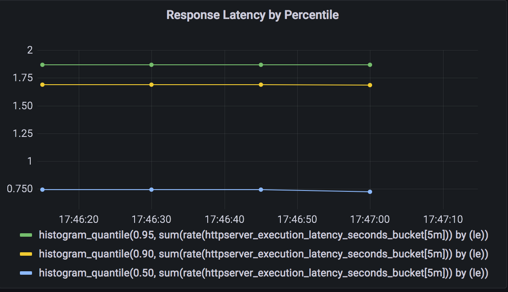

## 模块十作业				 		

1. 为 HTTPServer 添加 0-2 秒的随机延时；

   Main.go

   ```
   func rootHandler(w http.ResponseWriter, r *http.Request) {
   
     ...
     
         //模块10任务1：添加 0-2 秒的随机延时
   
         delay := randInt(10, 2000)
   
         time.Sleep(time.Millisecond * time.Duration(delay))
   
     ...
   
         //模块10任务1：延时时间输出log
   
         log.Info("Respond in ",delay, " ms")
   
   }
    
   ```

2. 为 HTTPServer 项目添加延时 Metric；

   Main.go

   ```
       //模块10任务2：添加Metric
   
       metrics.Register()
      
   
      func rootHandler(w http.ResponseWriter, r *http.Request) {
   
          log.Info("entering root handler")
   
          //模块10任务2：添加延时 Metric
   
          timer := metrics.NewTimer()
   
          defer timer.ObserveTotal()
   
       。。。
      }
   
   ```

3. 将 HTTPServer 部署至测试集群，并完成 Prometheus 配置；

   deployment.yaml

     

   ```
   template:
   
       metadata:
   
         annotations:
   
           prometheus.io/scrape: "true"
   
           prometheus.io/port: "8080"
   
         labels:
   
           app: httpserver
   
       spec:
   
         containers:
   
         \- name: httpserver 
   
           image: csmiao/httpserver:v1.0-metrics
   
           imagePullPolicy: IfNotPresent
   
           ports:
   
           \- containerPort: 8080
   ```

   

4. 从 Promethus 界面中查询延时指标数据；

5. （可选）创建一个 Grafana Dashboard 展现延时分配情况。

   

